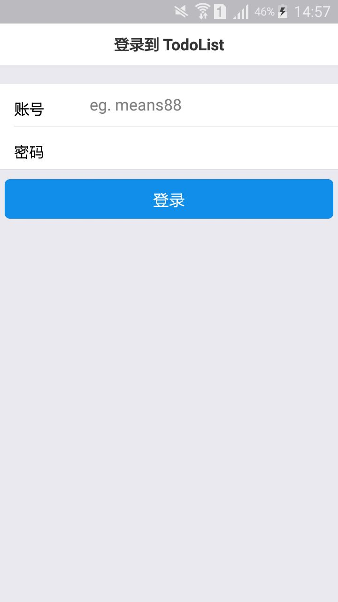
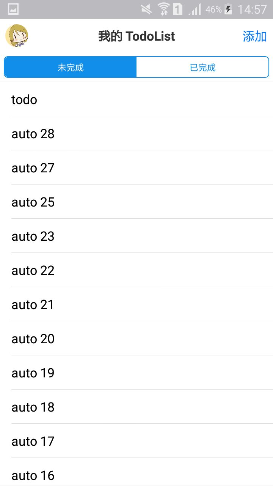
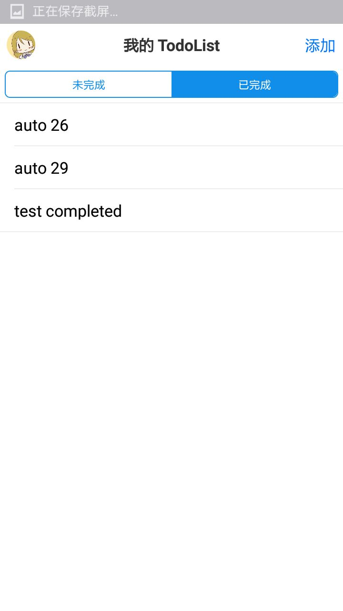
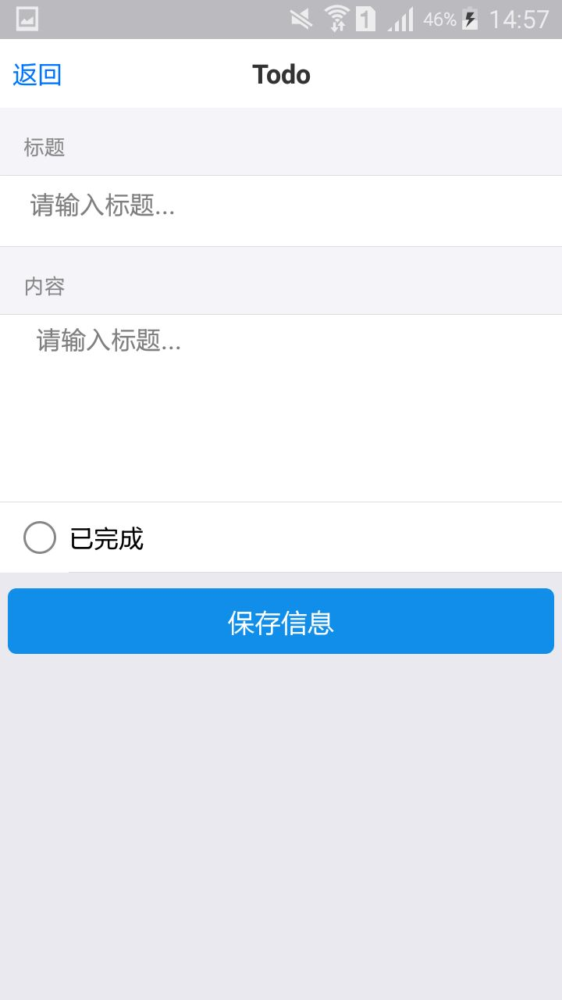
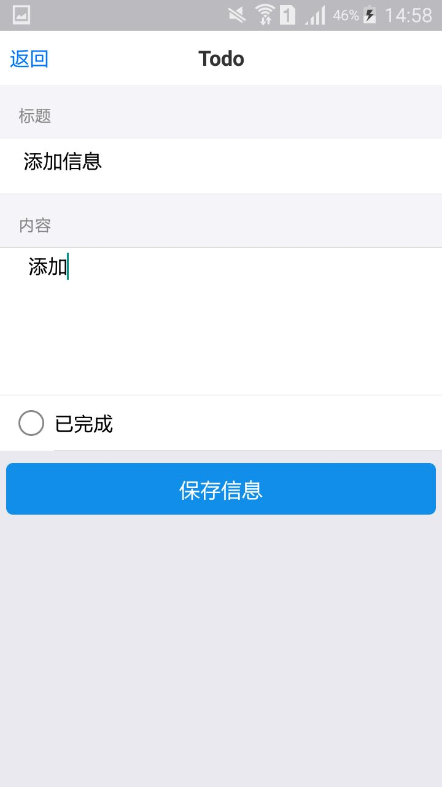
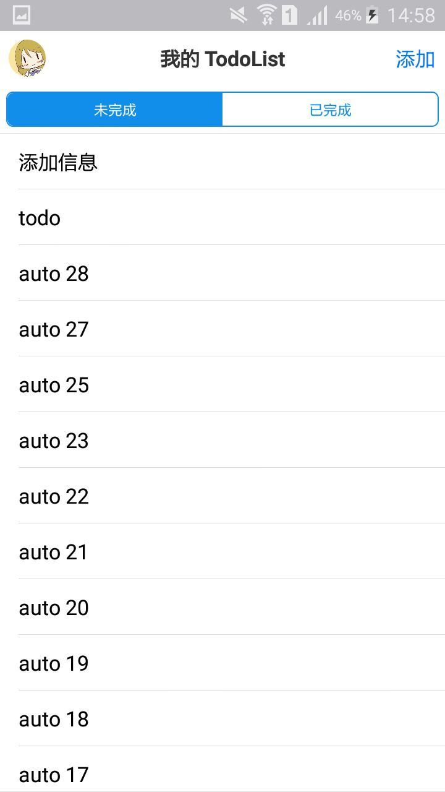
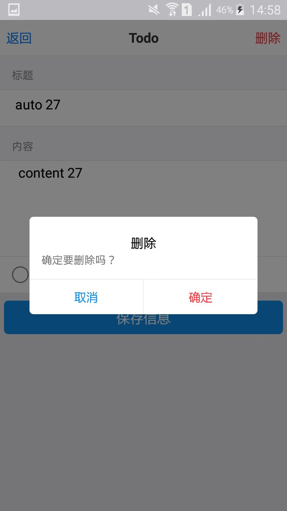
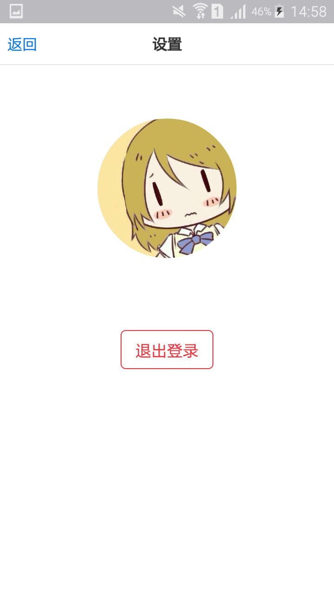

TodoList
===

Django
---
```
pip install -r requirements.txt
python manage.py migrate
python manage.py createsuperuser
python manage.py runserver 0.0.0.0:8000
```

React Native
---
Change `baseURL` in `TodoListClient/js/client.config.js` to Django server.
```
yarn start
react-native run-android
```

Screen Shots
---

